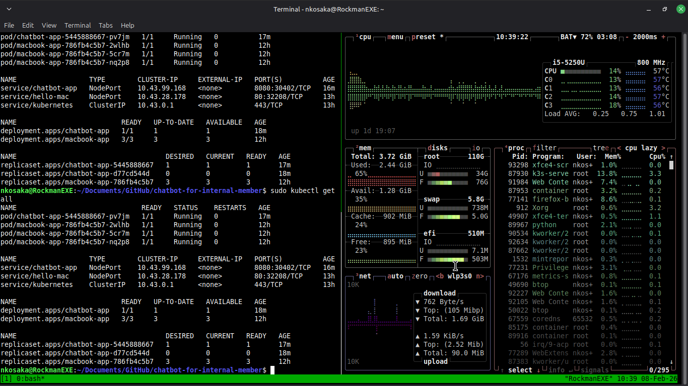

# FAQ Chatbot for internal member 

## Deployment Overview
* **Cloud (Production):** [Live Demo on Google Cloud Run](https://chatbot-service-898409023407.us-central1.run.app/)
* **Local Lab (Edge/Development):** Deployed on a **K3s (Kubernetes)** cluster hosted on a legacy MacBook (2015) running **Linux Mint**.

## Background

- I noticed our team lacked a strong internal knowledge base to support new employees.
- To address this, I began building a combined internal wiki and a user-friendly AI-powered chatbot.

## Expected user of this system

- Newer technician who needs fundamental knowledge
- Provide step-by-step troubleshooting, link to internal KBs

## Tech Stack

- Backend Development: Python, Flask, RESTful APIs
- Frondend Development: HTML5, CSS3, JavaScript (DOM manipulation, event handling, async fetch API)
- DB: Supabase, Postgres for vector DB
- AI Integration: Google Vertex AI (prompt engineering + RAG)
- Testing: Pytest (unit & integration testing)
- Security & Secrets Management: GitHub Secrets for API credentials and environment variables
- Observability: Cloud Logging & Monitoring (GCP)

### DevOps & Infrastructure
* **Cloud:** Docker, GitHub Actions (CI/CD), Terraform, Google Cloud Run
* **Local Lab:** K3s (Lightweight Kubernetes), Containerd
* **Monitoring:** `btop` for hardware telemetry and `kubectl` for cluster observability

## Hybrid Infrastructure & Learning Lab

As part of my growth, I expanded this project to run on a local **Hybrid-Cloud** environment. This allowed me to practice resource-constrained orchestration.

### The Challenge: 4GB RAM Constraints
Deploying a modern AI chatbot on 10-year-old hardware required strict resource management:
* **Orchestration:** Used **K3s** instead of standard K8s to minimize control plane overhead.
* **Resource Limits:** Configured YAML manifests with specific `limits` and `requests` (Memory: 500Mi, CPU: 500m) to prevent node pressure on the host OS.
* **Image Management:** Implemented a manual build-and-import workflow using `docker save` and `k3s ctr images import` to bypass the need for a remote registry.

### Local Cluster Status

*Above: Monitoring the cluster health using `btop`. Even with the Chatbot and MacBook-App running, memory usage remains optimized at ~65%.*

## Architecture diagram

## Screenshot

