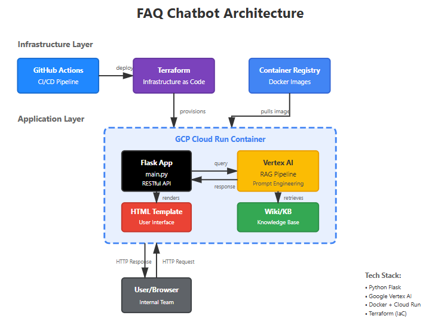
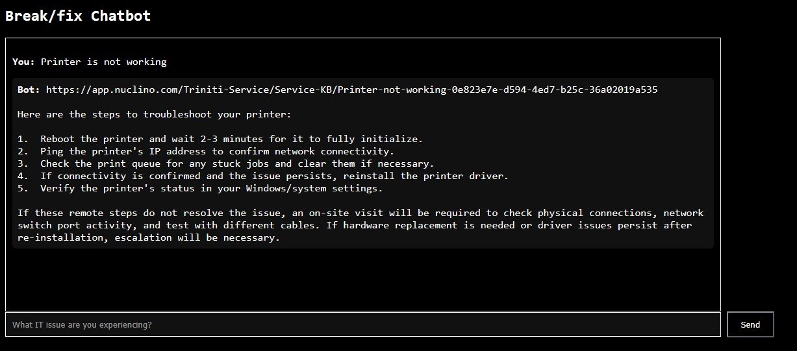

# FAQ Chatbot for internal member 

## Background

- I noticed our team lacked a strong internal knowledge base to support new employees.
- To address this, I began building a combined internal wiki and a user-friendly AI-powered chatbot.

## Expected user of this system

- Newer ish technician who needs fundamental knowledge
- Provide step-by-step troubleshooting, link to internal KBs

## Tech Stack

- Backend Development: Python, Flask, RESTful APIs
- Supabase, Postgres for vector DB
- AI Integration: Google Vertex AI (prompt engineering + RAG)
- Testing: Pytest (unit & integration testing)
- DevOps & Infrastructure: Docker, GitHub Actions (CI/CD), Terraform, Google Cloud Run

## Architecture diagram

## Tasks needs to be addressed by order

-   [X] define the frequent questions and answers for IT support context -> internal wiki created. Defined the frequent questions and answers.
-   [X] just prompt engineering might be enough based on it, or fine-tune the model -> prompt engineering + RAG used
-   [ ] deploy the model in /chatbot as simple MVP -> in progress

## Status

In development.

## Screenshot

